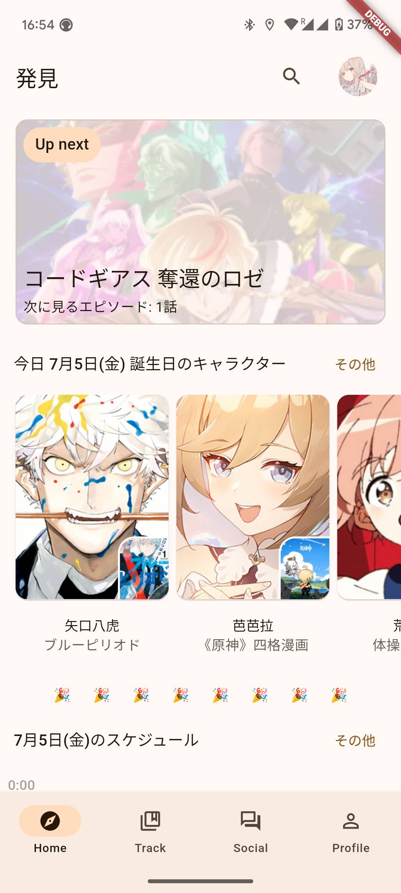
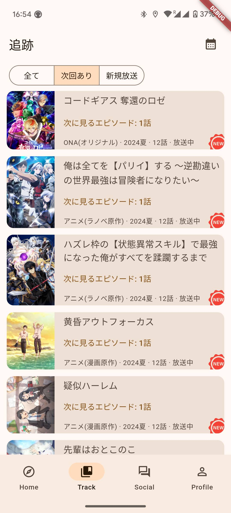
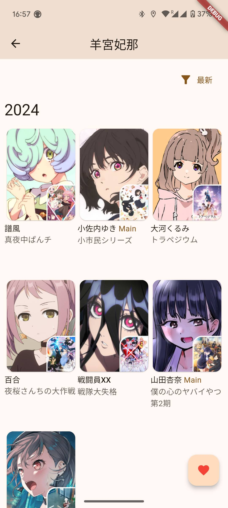
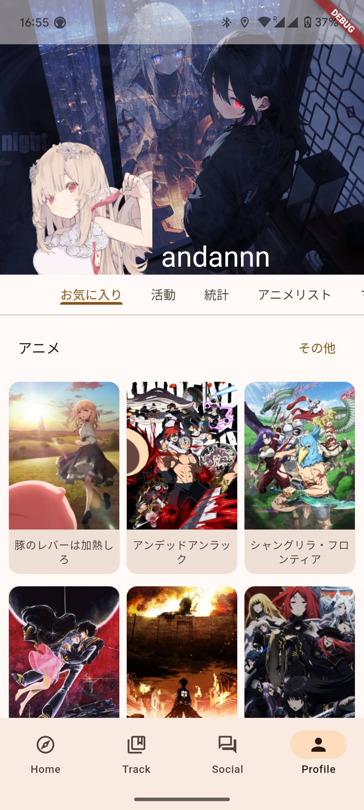
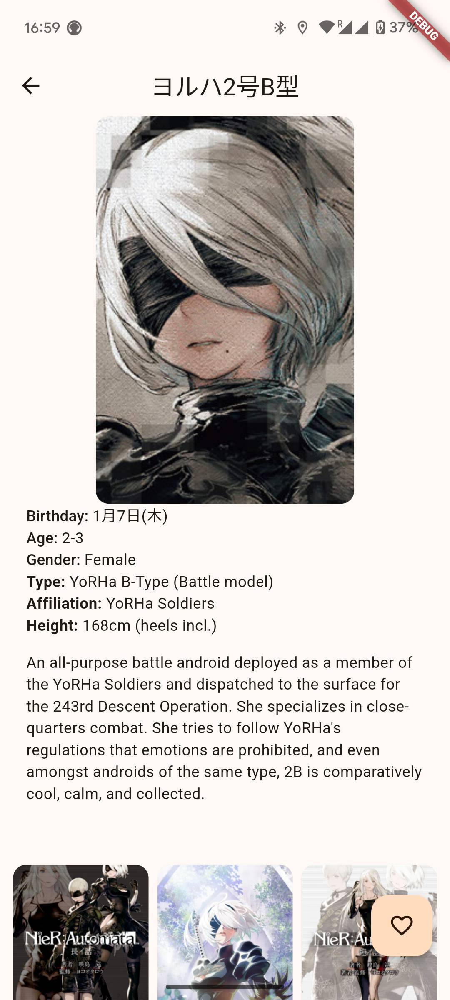
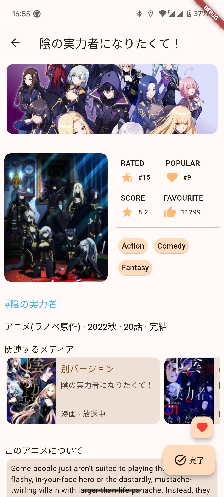

# AniFlow

An unofficial client for [AniList](https://anilist.co/home).

<p float="left">
  
  
  
  
  
  
</p>

## Feature
 - Support brows detail information of anime, manga, character, staff, studio.
 - Tracking the watching anime/manga in track page. and there will be a little bookmark in the tracked media.
 - (Beta) support text/media activity of user.

## Installation

1. [Install Flutter environment](https://docs.flutter.dev/get-started/install)
2. Run app with command:
```
flutter run
```

## Stack
 - Network: [Dio](https://pub.dev/packages/dio)
 - Database: [Drift](https://drift.simonbinder.eu/)
   - $ dart run drift_dev schema dump lib/core/database/aniflow_database.dart lib/core/database/drift_schemas/
   - $ dart run drift_dev schema steps lib/core/database/drift_schemas/ lib/core/database/drift_schemas/schema_versions.dart
   - $ dart run drift_dev schema generate lib/core/database/drift_schemas/ test/core/database/generated_migrations/
 - State Management: [Bloc](https://pub.dev/packages/bloc)
 - Dynamic theme: [dynamic_color](https://pub.dev/packages/dynamic_color)
